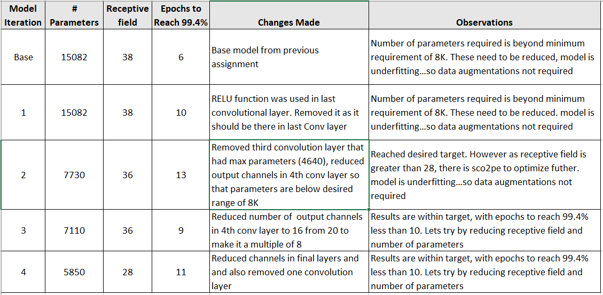

## Objective

Make a MNIST based model that has following characteristics:
 - 99.4% (this must be consistently shown in your last few epochs, and not a one-time achievement)
 - Less than or equal to 15 Epochs
 - Less than 8000 Parameters
 - Do this using your modular code. Every model that you make must be there in the model.py file as Model_1, Model_2, etc.
 - Once done, train on SageMaker or EC2

## Model Iteration Details  

## Final MNIST Model Architecture

## Training Logs Final Arcghitecture

## Sagemaker Test Logs  
