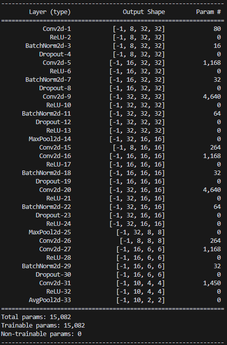
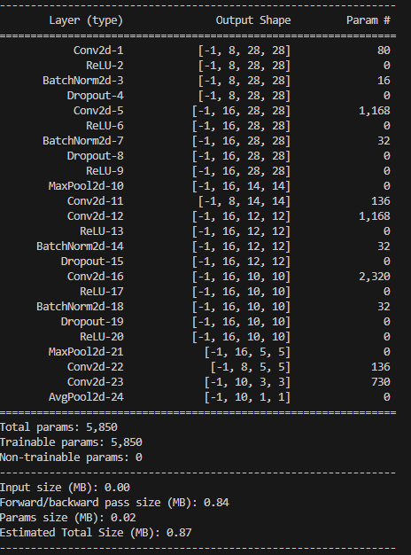
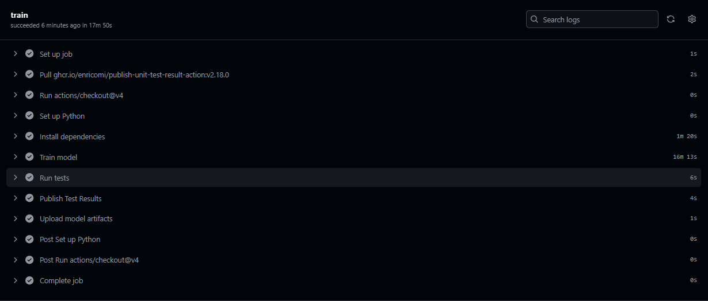
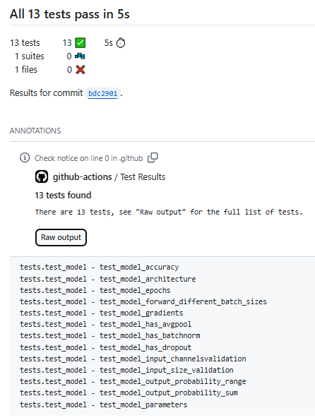

## Objective

Make a MNIST based model that has following characteristics:
 - 99.4% validation/test accuracy (50/10k split, basically we are calling Validation dataset as test dataset itself)
 - Less than 20k Parameters 
 - Less than 20 Epochs
Have used BN, Dropout,
(Optional): a Fully connected layer or, have used GAP. 

## MNIST Model Architecture

## MNIST Model Training Logs

## Tests Conducted
 1. Test Model Architecture - Accepts input of shape (1, 1, 28, 28)
 2. Test Model Parameters - Less than 20000 parameters
 3. Test Model Accuracy - More than 99.4%
 4. Test Model Epochs - Less than 20 Epochs
 5. Test Model Forward - Accepts different batch sizes [1, 4, 16, 32]
 6. Test model output probability range - Outputs are in valid probability range after softmax 
 7. Test model output probability sum - probabilities sum to 1
 8. Test model gradients - Gradients are properly computed  
 9. Test model input channel validation - Raises error for channels greater than 1
 10. Test model input size validation - Raises error for input size other than 28x28
 11. Test model batch normalization - Model contains batch normalization layers
 12. Test model dropout - Model contains dropout layers
 13. Test model has Average Pooling - Model contains average pooling layers

## Image Augmentations

    transforms.RandomRotation(degrees=5),      # Slight rotation (reduced from 15 to 10 degrees)
    transforms.RandomAffine(
        degrees=0,                             # No rotation in affine transform
        translate=(0.05, 0.05),                  # Random translation up to 10%
        scale=(0.95, 1.05)                       # Random scaling between 90% and 110%
        ),
    transforms.GaussianBlur(
        kernel_size=3,                         # Blur kernel size
        sigma=(0.01, 0.02)                       # Random sigma for blur
        )
## Github Actions

## Github Actions Test Status
